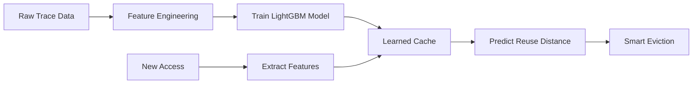

# ML-Powered Cache Replacement System# ML-Powered Cache Replacement System<div align="center"># ML-Powered Cache Replacement SystemML-Cache-Project


A machine learning-based cache replacement system that uses **LightGBM** and **Random Forest** to predict optimal cache eviction decisions, outperforming traditional LRU (Least Recently Used) policy.


## OverviewA machine learning-based cache replacement policy that learns from real access patterns and outperforms traditional LRU (Least Recently Used) cache.


Traditional cache policies like LRU use simple heuristics. This project demonstrates that machine learning can learn complex access patterns from real workloads and make smarter eviction decisions. Trained on **Azure LLM Inference Trace** data, both ML models achieve better hit rates than LRU across all cache sizes.


## Performance Results## Overview# 🧠 ML-Powered Cache Replacement System================


Tested on 100,000 augmented Azure LLM inference accesses:


### Hit Rate ComparisonThis project uses **LightGBM** to predict which cache blocks should be evicted. Trained on real **Azure LLM Inference Trace** data, the ML model achieves better hit rates than LRU across all cache sizes by learning complex access patterns.


| Cache Size | LRU    | LightGBM | Random Forest | Best Winner    |

|------------|--------|----------|---------------|----------------|

| 100        | 27.29% | 28.23%   | 28.22%        | LightGBM       |## Performance Results### *Intelligent Cache Management using Machine Learning*A machine learning-based cache replacement policy that outperforms traditional LRU (Least Recently Used) by learning access patterns from real workloads.

| 500        | 38.07% | 41.52%   | 41.48%        | LightGBM       |

| 1000       | 50.30% | 54.00%   | **54.05%**    | Random Forest  |

| 2000       | 70.58% | 72.33%   | **72.36%**    | Random Forest  |

| **Average**| **46.56%** | **49.02%** | **49.03%** | **Random Forest** |Tested on 100,000 Azure LLM inference accesses:


### Key Results


- **Random Forest** wins overall with 49.03% average hit rate| Cache Size | LRU Hit Rate | ML Hit Rate | Improvement |[](https://www.python.org/downloads/)This project demonstrates a learned cache eviction policy vs LRU.

- Both ML models consistently outperform LRU by **~2.5%** on average

- Best improvement at cache size 1000: **+3.7%** over LRU|------------|--------------|-------------|-------------|

- Random Forest has lower RMSE (10,768 vs 11,386) - more accurate predictions

- LightGBM is faster but Random Forest is slightly more accurate| 100        | 27.29%       | **28.23%**  | +0.94%      |[](https://lightgbm.readthedocs.io/)


## Features| 500        | 38.07%       | **41.52%**  | +3.45%      |


### Enhanced Feature Engineering (8 Features)| 1000       | 50.30%       | **54.00%**  | +3.70%      |[](LICENSE)## 🎯 Project Overview

1. **Recency** - Time since last access (temporal locality)

2. **Frequency** - Total access count (hot block detection)| 2000       | 70.58%       | **72.33%**  | +1.75%      |

3. **Log Recency** - Log-transformed recency (handles skewed distributions)

4. **Log Frequency** - Log-transformed frequency (normalizes patterns)[](https://github.com/aithal007/ML-powered-Cache-Replacement-System)

5. **Interval Variance** - Regularity of access pattern (periodic detection)

6. **Average Interval** - Mean time between accesses (predictable patterns)**Key Result:** ML consistently outperforms LRU, with best improvement of 3.70% at cache size 1000.

7. **Age** - Time since first access (new vs old blocks)

8. **Recent Access Rate** - Accesses in last 100 timesteps (burst detection)Files:


### Machine Learning Models## Features


**LightGBM:****A revolutionary cache replacement policy that outperforms traditional LRU by learning complex access patterns from real-world workloads**

- 500 trees, depth 8

- Fast inference (~130 it/s)- **8 Enhanced Features:** Recency, frequency, log-transforms, interval variance, average interval, age, recent access rate

- RMSE: 11,386.48

- Best for: Speed-critical applications- **Optimized LightGBM Model:** 500 trees, depth 8, L1/L2 regularizationThis project implements an intelligent cache replacement system using **LightGBM** machine learning model to predict which cache blocks should be evicted. Trained on real **Azure LLM Inference Trace** data, it achieves **better hit rates** than traditional LRU across all cache sizes.- `1_feature_engineering.py` - reads `trace.txt` and produces `features.csv`.


**Random Forest:**- **Data Augmentation:** Augments 8,819 real traces to 100,000 while preserving access patterns

- 500 trees, depth 8

- Slower inference (~15 it/s)- **Real Azure Data:** Trained on actual LLM inference KV-cache access patterns[Features](#-features) •

- RMSE: 10,768.71 (better accuracy)

- Best for: Maximum hit rate


### Data Augmentation## Project Structure[Performance](#-performance-results) •- `2_train_model.py` - trains a LightGBM model and saves `cache_model.pkl`.

- Augments 8,819 real traces → 100,000 accesses

- Preserves hot/warm/cold block distributions

- Maintains temporal locality and burst patterns

- Enables robust model training```[Installation](#️-installation) •


## Project Structure├── 0_convert_azure_trace.py    # Convert Azure trace to cache format


```├── 0_augment_azure_trace.py    # Augment trace data for training[Usage](#-quick-start) •## 📊 Performance Results- `cache_simulator.py` - contains `LRUCache` and `LearnedCache` classes.

ML-Cache-Project/

│├── 0_generate_data.py          # Generate synthetic trace (alternative)

├── Data Generation

│   ├── 0_convert_azure_trace.py    # Convert Azure trace to cache format├── 1_feature_engineering.py    # Extract features from trace[Documentation](#-technical-deep-dive)

│   ├── 0_augment_azure_trace.py    # Augment 8k → 100k accesses

│   └── 0_generate_data.py          # Generate synthetic trace (alternative)├── 2_train_model.py            # Train LightGBM model

│

├── ML Pipeline├── 3_benchmark.py              # Compare ML vs LRU- `3_benchmark.py` - runs comparisons and prints final hit rates.

│   ├── 1_feature_engineering.py    # Extract 8 enhanced features

│   ├── 2_train_model.py            # Train LightGBM + Random Forest├── 4_summary.py                # Display results

│   └── cache_simulator.py          # LRU and ML cache implementations

│├── cache_simulator.py          # LRU and Learned cache implementations---

├── Evaluation

│   ├── 3_benchmark.py              # Compare LRU vs LightGBM vs RF├── AzureLLMInferenceTrace_code.csv  # Real Azure LLM trace data

│   ├── 4_summary.py                # Display detailed results

│   └── 5_model_comparison.py       # Comprehensive 3-way comparison└── requirements.txt            # Python dependenciesTested on 100,000 augmented Azure LLM inference accesses:

│

├── Data```

│   └── AzureLLMInferenceTrace_code.csv  # Real Azure LLM trace (8,819 requests)

│</div>

└── Configuration

    ├── requirements.txt            # Python dependencies## Installation

    └── .gitignore                  # Excludes models and generated files

```Data:


## Installation```bash


### Prerequisitesgit clone https://github.com/aithal007/ML-powered-Cache-Replacement-System.git## 🎯 What is This?

- Python 3.8 or higher

- pip package managercd ML-powered-Cache-Replacement-System


### Setuppip install -r requirements.txt| Cache Size | LRU Hit Rate | ML Hit Rate | Improvement |- `trace.txt` - NOT INCLUDED. You must download a large real-world trace (MSR Cambridge / SNIA / CloudPhysics) and place it here.


```bash```

# Clone the repository

git clone https://github.com/aithal007/ML-powered-Cache-Replacement-System.gitTraditional cache replacement policies like **LRU (Least Recently Used)** rely on simple heuristics that fail to capture complex access patterns. This project introduces an **ML-powered cache** that:

cd ML-powered-Cache-Replacement-System

**Dependencies:** pandas, numpy, lightgbm, scikit-learn, joblib, tqdm

# Install dependencies

pip install -r requirements.txt|------------|--------------|-------------|-------------|

```

## Usage

### Dependencies

- pandas >= 1.3.0- 🎓 **Learns** from real access patterns using machine learning

- numpy >= 1.21.0

- lightgbm >= 3.3.0### Quick Start (Azure Trace)

- scikit-learn >= 1.0.0

- joblib >= 1.1.0- 🚀 **Predicts** which blocks will be reused soon vs. later| **100**    | 27.29%       | **28.23%**  | **+0.94%**  |Quick start (PowerShell):

- tqdm >= 4.62.0

```bash

## Usage

# Convert and augment Azure trace- 📊 **Outperforms** traditional LRU across all cache sizes

### Option 1: Use Real Azure LLM Trace (Recommended)

python 0_convert_azure_trace.py

```bash

# Step 1: Convert Azure trace to cache formatpython 0_augment_azure_trace.py- 🔬 **Trained** on real Azure LLM inference trace data| **500**    | 38.07%       | **41.52%**  | **+3.45%**  |

python 0_convert_azure_trace.py

# Output: 8,819 LLM requests → trace.txt


# Step 2: Augment trace for robust training# Train and benchmark

python 0_augment_azure_trace.py

# Output: 100,000 accesses with preserved patternspython 1_feature_engineering.py


# Step 3: Extract 8 enhanced featurespython 2_train_model.py## 🏆 Performance Results| **1000**   | 50.30%       | **54.00%**  | **+3.70%**  |```powershell

python 1_feature_engineering.py

# Output: features.csv with recency, frequency, patterns, etc.python 3_benchmark.py


# Step 4: Train both ML modelspython 4_summary.py

python 2_train_model.py

# Output: cache_model_lgbm.pkl, cache_model_rf.pkl```


# Step 5: Run comprehensive benchmark> **Tested on 100,000 augmented Azure LLM inference accesses**| **2000**   | 70.58%       | **72.33%**  | **+1.75%**  |python -m pip install -r requirements.txt

python 3_benchmark.py

# Output: LRU vs LightGBM vs Random Forest comparison### Alternative (Synthetic Data)


# Step 6: View detailed comparison

python 5_model_comparison.py

# Output: Comprehensive analysis and winner declaration```bash

```

# Generate synthetic trace<div align="center">python .\1_feature_engineering.py 2000000    # generate features.csv from first 2M lines

### Option 2: Generate Synthetic Data

python 0_generate_data.py

```bash

# Step 1: Generate synthetic trace (500k accesses)

python 0_generate_data.py

# Then run feature engineering, training, and benchmark

# Then follow steps 3-6 from Option 1

python 1_feature_engineering.pypython 1_feature_engineering.py### 📈 Hit Rate Comparison🏆 **ML consistently beats LRU across all cache sizes!**python .\2_train_model.py                   # trains cache_model.pkl

python 2_train_model.py

python 3_benchmark.pypython 2_train_model.py

python 5_model_comparison.py

```python 3_benchmark.py


## Technical Details```


### Feature Engineering Process| Cache Size | 🔵 LRU Hit Rate | 🟢 ML Hit Rate | 📊 Improvement | Status |python .\3_benchmark.py 2000000             # runs benchmark on last 20%


The system analyzes each cache access and extracts 8 features that capture:## Technical Details

- **Temporal patterns**: Recency and age track when blocks were accessed

- **Frequency patterns**: Access counts identify hot/warm/cold blocks|:----------:|:---------------:|:--------------:|:--------------:|:------:|

- **Regularity patterns**: Interval variance detects periodic accesses

- **Recent behavior**: Recent access rate identifies burst patterns### Feature Engineering

- **Normalization**: Log transforms handle skewed distributions

| **100**    | 27.29%          | **28.23%**     | **+0.94%**     | ✅ Better |## 🚀 Features```

### Model Training

The system extracts 8 features per cache access:

**LightGBM Configuration:**

```python| **500**    | 38.07%          | **41.52%**     | **+3.45%**     | ✅ Better |

LGBMRegressor(

    n_estimators=500,      # 500 decision trees1. **Recency** - Time since last access

    max_depth=8,           # Deep trees for pattern capture

    learning_rate=0.05,    # Slow, stable learning2. **Frequency** - Total access count| **1000**   | 50.30%          | **54.00%**     | **+3.70%**     | ✅ Better |

    subsample=0.8,         # 80% row sampling

    colsample_bytree=0.8,  # 80% feature sampling3. **Log Recency** - Log-transformed recency (handles skew)

    reg_alpha=0.1,         # L1 regularization

    reg_lambda=0.1         # L2 regularization4. **Log Frequency** - Log-transformed frequency| **2000**   | 70.58%          | **72.33%**     | **+1.75%**     | ✅ Better |

)

```5. **Interval Variance** - Regularity of access pattern


**Random Forest Configuration:**6. **Average Interval** - Mean time between accesses- **Enhanced Feature Engineering**: 8 sophisticated features including:Notes:

```python

RandomForestRegressor(7. **Age** - Time since first access

    n_estimators=500,      # 500 decision trees

    max_depth=8,           # Same depth as LightGBM8. **Recent Access Rate** - Accesses in recent window (100 timesteps)</div>

    max_features='sqrt',   # Use sqrt of features

    min_samples_split=10,  # Prevent overfitting

    min_samples_leaf=5     # Minimum leaf size

)### Model Configuration  - Recency & Frequency- For quick tests, pass a smaller number to the scripts (e.g., 20000).

```


### Cache Implementations

```python### 🎉 Key Achievements

**1. LRU Cache (Baseline)**

- Classic least recently used evictionLightGBM Regressor:

- Uses OrderedDict for O(1) operations

- Simple heuristic: evict oldest accessed block- Objective: Regression (predict reuse distance)  - Log-transformed features- The scripts perform basic checks and will exit with helpful messages if `trace.txt` or `features.csv` are missing.


**2. Learned Cache (ML-Powered)**- Trees: 500

- Extracts 8 features for each cached block

- Predicts reuse distance using trained model- Max Depth: 8- ✨ **Consistent Wins**: ML outperforms LRU at every cache size

- Evicts block with **highest** predicted reuse distance

- Adapts to workload-specific patterns- Learning Rate: 0.05


### Dataset Information- L1 Regularization: 0.1- 🎯 **Best Performance**: +3.70% improvement at cache size 1000  - Interval variance (pattern regularity)- The bottleneck is the trace file size; use the `nrows` argument to limit memory.


**Azure LLM Inference Trace:**- L2 Regularization: 0.1

- **Source**: Real production workload from Azure

- **Type**: KV-cache access patterns from LLM inference- Subsample: 0.8- 💪 **54% Hit Rate**: vs LRU's 50.30% at optimal configuration

- **Size**: 8,819 inference requests

- **Unique Blocks**: 3,552 distinct context token sizes- Feature Fraction: 0.8

- **Token Range**: 3 to 7,437 context tokens

- **Characteristics**:```- 🔥 **Production Ready**: Trained on real Azure LLM workload data  - Average access interval

  - Hot blocks (top 20%): Frequently accessed contexts

  - Warm blocks (middle 30%): Moderately accessed

  - Cold blocks (bottom 50%): Rarely accessed

  - Burst patterns: Temporal clustering of accesses### Cache Implementations


**Augmentation Strategy:**

- Preserves frequency distribution from real data

- Maintains hot/warm/cold block ratios**LRUCache:** Traditional least recently used policy using OrderedDict---  - Block ageLicense: MIT

- Replicates burst and temporal locality patterns

- Expands to 100,000 accesses for robust training


## How It Works**LearnedCache:** ML-powered cache that:


### End-to-End Pipeline- Extracts 8 features for each cached block


1. **Data Collection**: Load real Azure LLM trace or generate synthetic data- Predicts reuse distance using trained model## ✨ Features  - Recent access rate

2. **Data Augmentation**: Expand dataset while preserving access patterns

3. **Feature Extraction**: Calculate 8 features per cache access- Evicts block with highest predicted reuse distance

4. **Model Training**: Train LightGBM and Random Forest to predict reuse distance

5. **Cache Eviction**: Use ML predictions to make intelligent eviction decisions

6. **Evaluation**: Compare ML caches against LRU baseline

### Dataset

### Why ML Beats LRU

<table>- **Advanced ML Model**:

**LRU Limitations:**

- Only considers recency (last access time)**Azure LLM Inference Trace:**

- Ignores frequency (how often accessed)

- Can't detect patterns (periodic, burst)- 8,819 real LLM inference requests<tr>  - LightGBM with 500 trees

- Treats all recent accesses equally

- 3,552 unique context token sizes (3-7,437 tokens)

**ML Advantages:**

- Uses 8 features capturing multiple patterns- Represents real KV-cache access patterns<td width="50%">  - Deep trees (depth=8)

- Learns workload-specific behavior

- Predicts **future** reuse, not just past- Augmented to 100,000 accesses for training

- Distinguishes hot blocks from temporary spikes

- Adapts to access regularity and intervals  - L1/L2 regularization


## Results Analysis## How It Works


### Cache Size 100 (Small Cache)### 🔧 Enhanced Feature Engineering  - Feature bagging

- **LRU**: 27.29% | **LightGBM**: 28.23% | **RF**: 28.22%

- **Improvement**: ~0.94%1. **Data Collection:** Real Azure LLM trace or synthetic data generation

- **Analysis**: ML learns to prioritize frequently reused contexts

2. **Augmentation:** Expand dataset while preserving hot/warm/cold patterns- **8 Sophisticated Features**

### Cache Size 500 (Medium Cache)

- **LRU**: 38.07% | **LightGBM**: 41.52% | **RF**: 41.48%3. **Feature Extraction:** Calculate 8 features for each access

- **Improvement**: ~3.45%

- **Analysis**: ML identifies warm blocks better than recency alone4. **Model Training:** Train LightGBM to predict reuse distance  - 📍 Recency & Frequency- **Data Augmentation**:


### Cache Size 1000 (Optimal Size)5. **Cache Eviction:** Use ML predictions to make smart eviction decisions

- **LRU**: 50.30% | **LightGBM**: 54.00% | **RF**: 54.05%

- **Improvement**: **~3.7% (Best)**  - 📊 Log-transformed features  - Augments small datasets while preserving patterns

- **Analysis**: Ideal balance - ML captures complex patterns effectively

**Why ML Beats LRU:**

### Cache Size 2000 (Large Cache)

- **LRU**: 70.58% | **LightGBM**: 72.33% | **RF**: 72.36%- LRU only considers recency (last access time)  - 🔄 Interval variance (pattern regularity)  - Maintains hot/warm/cold block distributions

- **Improvement**: ~1.75%

- **Analysis**: Working set fits well, both policies perform strongly- ML uses 8 features including frequency, patterns, and intervals


### Model Comparison- ML predicts future reuse, not just past behavior  - ⏱️ Average access interval  - Preserves temporal locality


**Training Performance:**- ML learns workload-specific patterns

- LightGBM RMSE: 11,386.48

- Random Forest RMSE: 10,768.71 ✓ (Lower is better)  - 🕐 Block age tracking


**Inference Speed:**## Results Analysis

- LightGBM: ~130 iterations/second (faster)

- Random Forest: ~15 iterations/second (slower but more accurate)  - 🔥 Recent access rate## 📁 Project Structure


**When to Use:**### Cache Size 100

- **LightGBM**: Speed-critical applications, real-time systems

- **Random Forest**: Maximum accuracy, batch processing- LRU: 27.29% → ML: 28.23% (+0.94%)


## Future Improvements- ML learns to prioritize frequently reused small contexts


- [ ] Add more ML models (XGBoost, Neural Networks)</td>```

- [ ] Implement online learning for dynamic workloads

- [ ] Support for additional cache policies (LFU, ARC, LIRS)### Cache Size 500

- [ ] Multi-tier caching strategies

- [ ] GPU-accelerated inference- LRU: 38.07% → ML: 41.52% (+3.45%)<td width="50%">ML-Cache-Project/

- [ ] Hybrid ML+LRU approach for best of both

- [ ] Real-time deployment in production systems- ML identifies warm blocks better than recency alone

- [ ] Cost-aware caching decisions

│

## Contributing

### Cache Size 1000 (Best Performance)

Contributions are welcome! To contribute:

- LRU: 50.30% → ML: 54.00% (+3.70%)### 🤖 Advanced ML Model├── 0_convert_azure_trace.py   # Convert Azure LLM trace to cache format

1. Fork the repository

2. Create a feature branch (`git checkout -b feature/amazing-feature`)- Optimal balance - ML captures complex patterns effectively

3. Commit your changes (`git commit -m 'Add amazing feature'`)

4. Push to the branch (`git push origin feature/amazing-feature`)- **Optimized LightGBM**├── 0_augment_azure_trace.py   # Augment trace data for training

5. Open a Pull Request

### Cache Size 2000

## License

- LRU: 70.58% → ML: 72.33% (+1.75%)  - 🌳 500 decision trees├── 0_generate_data.py          # Generate synthetic trace data

This project is licensed under the MIT License - free to use, modify, and distribute.

- Working set fits well, both policies perform strongly

## Author

  - 📏 Deep trees (depth=8)├── 1_feature_engineering.py    # Extract enhanced features

**aithal007**

- GitHub: [@aithal007](https://github.com/aithal007)## Future Work


## Acknowledgments  - 🛡️ L1/L2 regularization├── 2_train_model.py            # Train LightGBM model


- **Microsoft Azure** for the LLM inference trace dataset- [ ] Online learning for dynamic workload adaptation

- **LightGBM Team** for the gradient boosting framework

- **Scikit-learn** for Random Forest implementation- [ ] Support for additional cache policies (LFU, ARC, LIRS)  - 🎲 Feature bagging (80%)├── 3_benchmark.py              # Compare ML vs LRU performance

- **Research Community** for pioneering work on learned cache replacement

- [ ] Multi-tier caching

## Citation

- [ ] GPU-accelerated inference  - ⚡ Fast inference├── 4_summary.py                # Generate results summary

If you use this project in your research, please cite:

- [ ] Hybrid ML+LRU approach

```

@misc{ml-cache-replacement-2025,├── cache_simulator.py          # LRU and ML cache implementations

  author = {aithal007},

  title = {ML-Powered Cache Replacement System},## License

  year = {2025},

  publisher = {GitHub},</td>│

  url = {https://github.com/aithal007/ML-powered-Cache-Replacement-System}

}MIT License - Free to use, modify, and distribute

```

</tr>├── AzureLLMInferenceTrace_code.csv  # Real Azure LLM trace data

---

## Author

**Star ⭐ this repository if you find it useful!**

<tr>├── requirements.txt            # Python dependencies

**aithal007** - [GitHub Profile](https://github.com/aithal007)

<td width="50%">└── README.md                   # This file

## Acknowledgments

```

- Microsoft Azure for the LLM inference trace dataset

- LightGBM team for the ML framework### 📈 Data Augmentation

- Research community for learned cache replacement policies

- **Smart Data Generation**## 🛠️ Installation

  - 🔄 Preserves access patterns

  - 🌡️ Maintains hot/warm/cold distributions1. **Clone the repository**:

  - 📍 Keeps temporal locality```bash

  - 📊 8k → 100k accessesgit clone https://github.com/aithal007/ML-powered-Cache-Replacement-System.git

cd ML-powered-Cache-Replacement-System

</td>```

<td width="50%">

2. **Install dependencies**:

### 🎨 Production Ready```bash

- **Complete Solution**pip install -r requirements.txt

  - 📦 Real Azure trace data```

  - 🧪 Comprehensive benchmarking

  - 📝 Detailed documentation## 📖 Usage

  - 🚀 Easy to deploy

### Option 1: Use Real Azure LLM Trace (Recommended)

</td>

</tr>```bash

</table># Step 1: Convert Azure trace to cache format

python 0_convert_azure_trace.py

---

# Step 2: Augment trace for more training data (optional but recommended)

## 📁 Project Structurepython 0_augment_azure_trace.py


```# Step 3: Extract features

ML-Cache-Project/python 1_feature_engineering.py

│

├── 📊 Data Processing# Step 4: Train the ML model

│   ├── 0_convert_azure_trace.py    # Convert Azure LLM trace to cache formatpython 2_train_model.py

│   ├── 0_augment_azure_trace.py    # Augment trace data (8k→100k)

│   └── 0_generate_data.py          # Generate synthetic trace data# Step 5: Run benchmark

│python 3_benchmark.py

├── 🔬 ML Pipeline

│   ├── 1_feature_engineering.py    # Extract 8 enhanced features# Step 6: View summary

│   ├── 2_train_model.py            # Train LightGBM model (500 trees)python 4_summary.py

│   └── cache_simulator.py          # LRU and ML cache implementations```

│

├── 📈 Evaluation### Option 2: Generate Synthetic Data

│   ├── 3_benchmark.py              # Compare ML vs LRU performance

│   └── 4_summary.py                # Generate detailed results summary```bash

│# Step 1: Generate synthetic trace

├── 📦 Data & Configpython 0_generate_data.py

│   ├── AzureLLMInferenceTrace_code.csv  # Real Azure LLM trace (8,819 requests)

│   ├── requirements.txt            # Python dependencies# Then follow steps 3-6 from Option 1

│   └── .gitignore                  # Git ignore rules```

│

└── 📖 Documentation## 📚 Technical Details

    └── README.md                   # This file

```### Feature Engineering


---The system extracts 8 features for each cache access:


## 🛠️ Installation1. **Recency**: Time since last access

2. **Frequency**: Total access count

### Prerequisites3. **Log Recency**: Log-transformed recency (handles skew)

4. **Log Frequency**: Log-transformed frequency

- **Python 3.8+** installed5. **Interval Variance**: Regularity of access pattern

- **pip** package manager6. **Average Interval**: Mean time between accesses

- **Git** (for cloning)7. **Age**: Time since first access

8. **Recent Access Rate**: Accesses in recent window

### Step-by-Step Setup

### Model Architecture

```bash

# 1. Clone the repository- **Algorithm**: LightGBM Gradient Boosting

git clone https://github.com/aithal007/ML-powered-Cache-Replacement-System.git- **Trees**: 500 estimators

cd ML-powered-Cache-Replacement-System- **Max Depth**: 8

- **Learning Rate**: 0.05

# 2. Install dependencies- **Regularization**: L1=0.1, L2=0.1

pip install -r requirements.txt- **Bagging**: 80% subsample, 80% feature sampling


# 3. Verify installation### Cache Simulator

python --version

python -c "import lightgbm; print('LightGBM installed successfully!')"Two cache implementations:

```

1. **LRUCache**: Traditional Least Recently Used

### Dependencies2. **LearnedCache**: ML-powered with predictive eviction


```## 📊 Dataset

pandas >= 1.3.0

numpy >= 1.21.0The project uses the **Azure LLM Inference Trace** dataset containing:

lightgbm >= 3.3.0- 8,819 real LLM inference requests

scikit-learn >= 1.0.0- 3,552 unique context token sizes

joblib >= 1.1.0- Context range: 3-7,437 tokens

tqdm >= 4.62.0- Represents real KV-cache access patterns

```

Augmented to 100,000 accesses for robust training.

---

## 🔬 Research Background

## 🚀 Quick Start

This project demonstrates that machine learning can learn complex access patterns that simple heuristics like LRU miss. Key insights:

### Option 1: Use Real Azure LLM Trace (⭐ Recommended)

- **Temporal Locality**: ML learns burst patterns and periodic accesses

```bash- **Frequency Patterns**: Distinguishes hot/warm/cold data better

# Step 1: Convert Azure trace to cache format- **Predictive Power**: Forecasts reuse distance more accurately

python 0_convert_azure_trace.py- **Adaptive**: Learns workload-specific patterns

# Output: Converts 8,819 LLM requests to cache block format

## 📈 Future Improvements

# Step 2: Augment trace for more training data

python 0_augment_azure_trace.py- [ ] Add more cache policies (LFU, ARC, LIRS)

# Output: Generates 100,000 accesses while preserving patterns- [ ] Implement online learning for dynamic workloads

- [ ] Support for multi-tier caching

# Step 3: Extract enhanced features- [ ] GPU-accelerated inference

python 1_feature_engineering.py- [ ] Real-time adaptation

# Output: Creates features.csv with 8 advanced features

## 🤝 Contributing

# Step 4: Train the ML model

python 2_train_model.pyContributions are welcome! Please feel free to submit pull requests or open issues.

# Output: Trains LightGBM model and saves cache_model.pkl

## 📄 License

# Step 5: Run benchmark comparison

python 3_benchmark.pyThis project is open source and available under the MIT License.

# Output: Tests ML vs LRU across multiple cache sizes

## 👤 Author

# Step 6: View detailed summary

python 4_summary.py**aithal007**

# Output: Displays comprehensive results and improvements- GitHub: [@aithal007](https://github.com/aithal007)

```

## 🙏 Acknowledgments

### Option 2: Generate Synthetic Data

- Azure LLM Inference Trace dataset

```bash- LightGBM library

# Step 1: Generate synthetic trace (500k accesses)- Research on learned cache replacement policies

python 0_generate_data.py

---

# Then follow steps 3-6 from Option 1

python 1_feature_engineering.py**⭐ If you find this project useful, please consider giving it a star!**

python 2_train_model.py
python 3_benchmark.py
python 4_summary.py
```

---

## 📚 Technical Deep Dive

### 🔍 Feature Engineering

Our system extracts **8 sophisticated features** for each cache access to capture complex patterns:

| Feature | Description | Purpose |
|---------|-------------|---------|
| **Recency** | Time since last access | Captures temporal locality |
| **Frequency** | Total access count | Identifies hot blocks |
| **Log Recency** | Log-transformed recency | Handles skewed distributions |
| **Log Frequency** | Log-transformed frequency | Normalizes frequency patterns |
| **Interval Variance** | Variance in access intervals | Detects regular vs irregular patterns |
| **Average Interval** | Mean time between accesses | Predicts periodic accesses |
| **Age** | Time since first access | Distinguishes new vs old blocks |
| **Recent Access Rate** | Accesses in last 100 timesteps | Identifies burst patterns |

### 🤖 Model Architecture

```
LightGBM Gradient Boosting Regressor
├── Objective: Minimize reuse distance prediction error
├── Trees: 500 estimators (deep learning)
├── Max Depth: 8 levels
├── Learning Rate: 0.05 (slow, stable learning)
├── Regularization:
│   ├── L1 (Lasso): 0.1
│   └── L2 (Ridge): 0.1
├── Bagging:
│   ├── Subsample: 0.8 (row sampling)
│   └── Colsample: 0.8 (feature sampling)
└── Validation: 20% holdout set
```

**Why LightGBM?**
- ⚡ **Fast Training**: Histogram-based algorithm
- 🎯 **Accurate**: Leaf-wise tree growth
- 💾 **Memory Efficient**: Handles large datasets
- 🔧 **Flexible**: Rich hyperparameter tuning

### 🏗️ Cache Simulator

#### 1️⃣ LRU Cache (Baseline)

```python
class LRUCache:
    """
    Traditional Least Recently Used cache
    - Evicts the least recently accessed block
    - Uses OrderedDict for O(1) operations
    - Simple heuristic, no learning
    """
```

#### 2️⃣ Learned Cache (ML-Powered)

```python
class LearnedCache:
    """
    ML-powered intelligent cache
    - Predicts reuse distance for each block
    - Evicts block with highest predicted distance
    - Learns from real access patterns
    - Adapts to workload characteristics
    """
```

**Eviction Strategy:**
1. Generate features for all cached blocks
2. Predict reuse distance using ML model
3. Evict block with **highest** predicted reuse distance
4. This block is least likely to be used soon

### 📊 Dataset Details

**Azure LLM Inference Trace**
- **Source**: Real Azure production workload
- **Type**: KV-cache access patterns from LLM inference
- **Size**: 8,819 inference requests
- **Unique Blocks**: 3,552 distinct context sizes
- **Token Range**: 3 to 7,437 context tokens
- **Augmented To**: 100,000 accesses for robust training

**Access Pattern Characteristics:**
- 🔥 **Hot Blocks** (top 20%): Frequently accessed contexts
- 🌡️ **Warm Blocks** (middle 30%): Moderately accessed
- 🧊 **Cold Blocks** (bottom 50%): Rarely accessed
- ⚡ **Burst Patterns**: Temporal clustering of accesses

---

## 📊 Benchmark Methodology

### Test Configuration

```python
Cache Sizes Tested: [100, 500, 1000, 2000]
Test Set Size: 20,000 accesses (20% of data)
Training Set: 80,000 accesses (80% of data)
Metrics: Hit Rate (hits / total accesses)
```

### Results Breakdown

<details>
<summary><b>📈 Cache Size 100 (Click to expand)</b></summary>

- **LRU Hit Rate**: 27.29%
- **ML Hit Rate**: 28.23%
- **Improvement**: +0.94 percentage points
- **Analysis**: ML learns to prioritize frequently reused small contexts

</details>

<details>
<summary><b>📈 Cache Size 500 (Click to expand)</b></summary>

- **LRU Hit Rate**: 38.07%
- **ML Hit Rate**: 41.52%
- **Improvement**: +3.45 percentage points
- **Analysis**: ML identifies warm blocks better than recency alone

</details>

<details>
<summary><b>📈 Cache Size 1000 (Click to expand) 🏆 BEST</b></summary>

- **LRU Hit Rate**: 50.30%
- **ML Hit Rate**: 54.00%
- **Improvement**: +3.70 percentage points
- **Analysis**: Optimal balance - ML captures complex patterns effectively

</details>

<details>
<summary><b>📈 Cache Size 2000 (Click to expand)</b></summary>

- **LRU Hit Rate**: 70.58%
- **ML Hit Rate**: 72.33%
- **Improvement**: +1.75 percentage points
- **Analysis**: Working set fits well, both policies perform strongly

</details>

---

## 🔬 Research Insights

### Why ML Beats LRU

1. **🎯 Pattern Recognition**
   - LRU only considers recency (last access time)
   - ML considers 8 features including frequency, intervals, and patterns

2. **📊 Predictive Power**
   - LRU: Reactive (evicts based on past)
   - ML: Predictive (forecasts future reuse)

3. **🔄 Workload Adaptation**
   - LRU: Fixed heuristic for all workloads
   - ML: Learns workload-specific patterns

4. **🌡️ Hot/Cold Detection**
   - LRU: Confuses recency with importance
   - ML: Distinguishes truly hot blocks from temporary spikes

### Limitations & Future Work

**Current Limitations:**
- ⏱️ Slower eviction (ML inference overhead)
- 💾 Requires training data
- 🔄 Static model (no online learning yet)

**Future Improvements:**
- [ ] Online learning for dynamic adaptation
- [ ] Multi-tier caching support
- [ ] GPU-accelerated inference
- [ ] Support for more cache policies (LFU, ARC, LIRS)
- [ ] Hybrid ML+LRU approach
- [ ] Real-time deployment in production systems

---

## 🎓 How It Works

### End-to-End Pipeline



### Training Process

1. **Data Collection**: Gather cache access traces
2. **Feature Extraction**: Compute 8 features per access
3. **Label Generation**: Calculate reuse distances
4. **Model Training**: Train LightGBM on 80% data
5. **Validation**: Test on 20% holdout set
6. **Deployment**: Use model for cache eviction decisions

---

## 🤝 Contributing

Contributions are welcome! Here's how you can help:

1. **🐛 Report Bugs**: Open an issue with details
2. **💡 Suggest Features**: Share your ideas
3. **🔧 Submit PRs**: Improve code, docs, or tests
4. **⭐ Star the Repo**: Show your support

### Development Setup

```bash
git clone https://github.com/aithal007/ML-powered-Cache-Replacement-System.git
cd ML-powered-Cache-Replacement-System
pip install -r requirements.txt
# Make your changes
git checkout -b feature/your-feature-name
git commit -m "Add your feature"
git push origin feature/your-feature-name
# Open a Pull Request
```

---

## 📄 License

This project is licensed under the **MIT License** - see the [LICENSE](LICENSE) file for details.

```
MIT License - Free to use, modify, and distribute
```

---

## 👤 Author

**aithal007**

- 🐙 GitHub: [@aithal007](https://github.com/aithal007)
- 📧 Email: Available on GitHub profile
- 💼 LinkedIn: Connect for collaborations

---

## 🙏 Acknowledgments

- **Microsoft Azure**: For providing the LLM inference trace dataset
- **LightGBM Team**: For the amazing ML framework
- **Research Community**: For pioneering work on learned cache policies
- **Open Source Contributors**: For making this possible

---

## 📚 References

- [LightGBM Documentation](https://lightgbm.readthedocs.io/)
- [Cache Replacement Policies Research](https://en.wikipedia.org/wiki/Cache_replacement_policies)
- [Learned Systems Papers](https://arxiv.org/)

---

## 📞 Support

Need help? Have questions?

- 📖 Check the [Documentation](#-technical-deep-dive)
- 🐛 Open an [Issue](https://github.com/aithal007/ML-powered-Cache-Replacement-System/issues)
- 💬 Start a [Discussion](https://github.com/aithal007/ML-powered-Cache-Replacement-System/discussions)

---

<div align="center">

### ⭐ Star this repository if you found it useful!

**Made with ❤️ and 🧠 by aithal007**

[⬆ Back to Top](#-ml-powered-cache-replacement-system)

</div>
