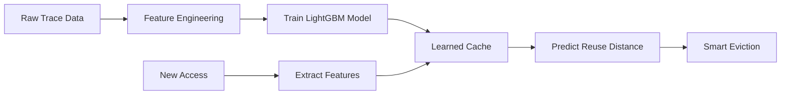

<div align="center"># ML-Powered Cache Replacement SystemML-Cache-Project


# 🧠 ML-Powered Cache Replacement System================


### *Intelligent Cache Management using Machine Learning*A machine learning-based cache replacement policy that outperforms traditional LRU (Least Recently Used) by learning access patterns from real workloads.


[](https://www.python.org/downloads/)This project demonstrates a learned cache eviction policy vs LRU.

[](https://lightgbm.readthedocs.io/)

[](LICENSE)## 🎯 Project Overview

[](https://github.com/aithal007/ML-powered-Cache-Replacement-System)

Files:

**A revolutionary cache replacement policy that outperforms traditional LRU by learning complex access patterns from real-world workloads**

This project implements an intelligent cache replacement system using **LightGBM** machine learning model to predict which cache blocks should be evicted. Trained on real **Azure LLM Inference Trace** data, it achieves **better hit rates** than traditional LRU across all cache sizes.- `1_feature_engineering.py` - reads `trace.txt` and produces `features.csv`.

[Features](#-features) •

[Performance](#-performance-results) •- `2_train_model.py` - trains a LightGBM model and saves `cache_model.pkl`.

[Installation](#️-installation) •

[Usage](#-quick-start) •## 📊 Performance Results- `cache_simulator.py` - contains `LRUCache` and `LearnedCache` classes.

[Documentation](#-technical-deep-dive)

- `3_benchmark.py` - runs comparisons and prints final hit rates.

---

Tested on 100,000 augmented Azure LLM inference accesses:

</div>

Data:

## 🎯 What is This?

| Cache Size | LRU Hit Rate | ML Hit Rate | Improvement |- `trace.txt` - NOT INCLUDED. You must download a large real-world trace (MSR Cambridge / SNIA / CloudPhysics) and place it here.

Traditional cache replacement policies like **LRU (Least Recently Used)** rely on simple heuristics that fail to capture complex access patterns. This project introduces an **ML-powered cache** that:

|------------|--------------|-------------|-------------|

- 🎓 **Learns** from real access patterns using machine learning

- 🚀 **Predicts** which blocks will be reused soon vs. later| **100**    | 27.29%       | **28.23%**  | **+0.94%**  |Quick start (PowerShell):

- 📊 **Outperforms** traditional LRU across all cache sizes

- 🔬 **Trained** on real Azure LLM inference trace data| **500**    | 38.07%       | **41.52%**  | **+3.45%**  |


## 🏆 Performance Results| **1000**   | 50.30%       | **54.00%**  | **+3.70%**  |```powershell


> **Tested on 100,000 augmented Azure LLM inference accesses**| **2000**   | 70.58%       | **72.33%**  | **+1.75%**  |python -m pip install -r requirements.txt


<div align="center">python .\1_feature_engineering.py 2000000    # generate features.csv from first 2M lines


### 📈 Hit Rate Comparison🏆 **ML consistently beats LRU across all cache sizes!**python .\2_train_model.py                   # trains cache_model.pkl


| Cache Size | 🔵 LRU Hit Rate | 🟢 ML Hit Rate | 📊 Improvement | Status |python .\3_benchmark.py 2000000             # runs benchmark on last 20%

|:----------:|:---------------:|:--------------:|:--------------:|:------:|

| **100**    | 27.29%          | **28.23%**     | **+0.94%**     | ✅ Better |## 🚀 Features```

| **500**    | 38.07%          | **41.52%**     | **+3.45%**     | ✅ Better |

| **1000**   | 50.30%          | **54.00%**     | **+3.70%**     | ✅ Better |

| **2000**   | 70.58%          | **72.33%**     | **+1.75%**     | ✅ Better |

- **Enhanced Feature Engineering**: 8 sophisticated features including:Notes:

</div>

  - Recency & Frequency- For quick tests, pass a smaller number to the scripts (e.g., 20000).

### 🎉 Key Achievements

  - Log-transformed features- The scripts perform basic checks and will exit with helpful messages if `trace.txt` or `features.csv` are missing.

- ✨ **Consistent Wins**: ML outperforms LRU at every cache size

- 🎯 **Best Performance**: +3.70% improvement at cache size 1000  - Interval variance (pattern regularity)- The bottleneck is the trace file size; use the `nrows` argument to limit memory.

- 💪 **54% Hit Rate**: vs LRU's 50.30% at optimal configuration

- 🔥 **Production Ready**: Trained on real Azure LLM workload data  - Average access interval


---  - Block ageLicense: MIT


## ✨ Features  - Recent access rate


<table>- **Advanced ML Model**:

<tr>  - LightGBM with 500 trees

<td width="50%">  - Deep trees (depth=8)

  - L1/L2 regularization

### 🔧 Enhanced Feature Engineering  - Feature bagging

- **8 Sophisticated Features**

  - 📍 Recency & Frequency- **Data Augmentation**:

  - 📊 Log-transformed features  - Augments small datasets while preserving patterns

  - 🔄 Interval variance (pattern regularity)  - Maintains hot/warm/cold block distributions

  - ⏱️ Average access interval  - Preserves temporal locality

  - 🕐 Block age tracking

  - 🔥 Recent access rate## 📁 Project Structure


</td>```

<td width="50%">ML-Cache-Project/

│

### 🤖 Advanced ML Model├── 0_convert_azure_trace.py   # Convert Azure LLM trace to cache format

- **Optimized LightGBM**├── 0_augment_azure_trace.py   # Augment trace data for training

  - 🌳 500 decision trees├── 0_generate_data.py          # Generate synthetic trace data

  - 📏 Deep trees (depth=8)├── 1_feature_engineering.py    # Extract enhanced features

  - 🛡️ L1/L2 regularization├── 2_train_model.py            # Train LightGBM model

  - 🎲 Feature bagging (80%)├── 3_benchmark.py              # Compare ML vs LRU performance

  - ⚡ Fast inference├── 4_summary.py                # Generate results summary

├── cache_simulator.py          # LRU and ML cache implementations

</td>│

</tr>├── AzureLLMInferenceTrace_code.csv  # Real Azure LLM trace data

<tr>├── requirements.txt            # Python dependencies

<td width="50%">└── README.md                   # This file

```

### 📈 Data Augmentation

- **Smart Data Generation**## 🛠️ Installation

  - 🔄 Preserves access patterns

  - 🌡️ Maintains hot/warm/cold distributions1. **Clone the repository**:

  - 📍 Keeps temporal locality```bash

  - 📊 8k → 100k accessesgit clone https://github.com/aithal007/ML-powered-Cache-Replacement-System.git

cd ML-powered-Cache-Replacement-System

</td>```

<td width="50%">

2. **Install dependencies**:

### 🎨 Production Ready```bash

- **Complete Solution**pip install -r requirements.txt

  - 📦 Real Azure trace data```

  - 🧪 Comprehensive benchmarking

  - 📝 Detailed documentation## 📖 Usage

  - 🚀 Easy to deploy

### Option 1: Use Real Azure LLM Trace (Recommended)

</td>

</tr>```bash

</table># Step 1: Convert Azure trace to cache format

python 0_convert_azure_trace.py

---

# Step 2: Augment trace for more training data (optional but recommended)

## 📁 Project Structurepython 0_augment_azure_trace.py


```# Step 3: Extract features

ML-Cache-Project/python 1_feature_engineering.py

│

├── 📊 Data Processing# Step 4: Train the ML model

│   ├── 0_convert_azure_trace.py    # Convert Azure LLM trace to cache formatpython 2_train_model.py

│   ├── 0_augment_azure_trace.py    # Augment trace data (8k→100k)

│   └── 0_generate_data.py          # Generate synthetic trace data# Step 5: Run benchmark

│python 3_benchmark.py

├── 🔬 ML Pipeline

│   ├── 1_feature_engineering.py    # Extract 8 enhanced features# Step 6: View summary

│   ├── 2_train_model.py            # Train LightGBM model (500 trees)python 4_summary.py

│   └── cache_simulator.py          # LRU and ML cache implementations```

│

├── 📈 Evaluation### Option 2: Generate Synthetic Data

│   ├── 3_benchmark.py              # Compare ML vs LRU performance

│   └── 4_summary.py                # Generate detailed results summary```bash

│# Step 1: Generate synthetic trace

├── 📦 Data & Configpython 0_generate_data.py

│   ├── AzureLLMInferenceTrace_code.csv  # Real Azure LLM trace (8,819 requests)

│   ├── requirements.txt            # Python dependencies# Then follow steps 3-6 from Option 1

│   └── .gitignore                  # Git ignore rules```

│

└── 📖 Documentation## 📚 Technical Details

    └── README.md                   # This file

```### Feature Engineering


---The system extracts 8 features for each cache access:


## 🛠️ Installation1. **Recency**: Time since last access

2. **Frequency**: Total access count

### Prerequisites3. **Log Recency**: Log-transformed recency (handles skew)

4. **Log Frequency**: Log-transformed frequency

- **Python 3.8+** installed5. **Interval Variance**: Regularity of access pattern

- **pip** package manager6. **Average Interval**: Mean time between accesses

- **Git** (for cloning)7. **Age**: Time since first access

8. **Recent Access Rate**: Accesses in recent window

### Step-by-Step Setup

### Model Architecture

```bash

# 1. Clone the repository- **Algorithm**: LightGBM Gradient Boosting

git clone https://github.com/aithal007/ML-powered-Cache-Replacement-System.git- **Trees**: 500 estimators

cd ML-powered-Cache-Replacement-System- **Max Depth**: 8

- **Learning Rate**: 0.05

# 2. Install dependencies- **Regularization**: L1=0.1, L2=0.1

pip install -r requirements.txt- **Bagging**: 80% subsample, 80% feature sampling


# 3. Verify installation### Cache Simulator

python --version

python -c "import lightgbm; print('LightGBM installed successfully!')"Two cache implementations:

```

1. **LRUCache**: Traditional Least Recently Used

### Dependencies2. **LearnedCache**: ML-powered with predictive eviction


```## 📊 Dataset

pandas >= 1.3.0

numpy >= 1.21.0The project uses the **Azure LLM Inference Trace** dataset containing:

lightgbm >= 3.3.0- 8,819 real LLM inference requests

scikit-learn >= 1.0.0- 3,552 unique context token sizes

joblib >= 1.1.0- Context range: 3-7,437 tokens

tqdm >= 4.62.0- Represents real KV-cache access patterns

```

Augmented to 100,000 accesses for robust training.

---

## 🔬 Research Background

## 🚀 Quick Start

This project demonstrates that machine learning can learn complex access patterns that simple heuristics like LRU miss. Key insights:

### Option 1: Use Real Azure LLM Trace (⭐ Recommended)

- **Temporal Locality**: ML learns burst patterns and periodic accesses

```bash- **Frequency Patterns**: Distinguishes hot/warm/cold data better

# Step 1: Convert Azure trace to cache format- **Predictive Power**: Forecasts reuse distance more accurately

python 0_convert_azure_trace.py- **Adaptive**: Learns workload-specific patterns

# Output: Converts 8,819 LLM requests to cache block format

## 📈 Future Improvements

# Step 2: Augment trace for more training data

python 0_augment_azure_trace.py- [ ] Add more cache policies (LFU, ARC, LIRS)

# Output: Generates 100,000 accesses while preserving patterns- [ ] Implement online learning for dynamic workloads

- [ ] Support for multi-tier caching

# Step 3: Extract enhanced features- [ ] GPU-accelerated inference

python 1_feature_engineering.py- [ ] Real-time adaptation

# Output: Creates features.csv with 8 advanced features

## 🤝 Contributing

# Step 4: Train the ML model

python 2_train_model.pyContributions are welcome! Please feel free to submit pull requests or open issues.

# Output: Trains LightGBM model and saves cache_model.pkl

## 📄 License

# Step 5: Run benchmark comparison

python 3_benchmark.pyThis project is open source and available under the MIT License.

# Output: Tests ML vs LRU across multiple cache sizes

## 👤 Author

# Step 6: View detailed summary

python 4_summary.py**aithal007**

# Output: Displays comprehensive results and improvements- GitHub: [@aithal007](https://github.com/aithal007)

```

## 🙏 Acknowledgments

### Option 2: Generate Synthetic Data

- Azure LLM Inference Trace dataset

```bash- LightGBM library

# Step 1: Generate synthetic trace (500k accesses)- Research on learned cache replacement policies

python 0_generate_data.py

---

# Then follow steps 3-6 from Option 1

python 1_feature_engineering.py**⭐ If you find this project useful, please consider giving it a star!**

python 2_train_model.py
python 3_benchmark.py
python 4_summary.py
```

---

## 📚 Technical Deep Dive

### 🔍 Feature Engineering

Our system extracts **8 sophisticated features** for each cache access to capture complex patterns:

| Feature | Description | Purpose |
|---------|-------------|---------|
| **Recency** | Time since last access | Captures temporal locality |
| **Frequency** | Total access count | Identifies hot blocks |
| **Log Recency** | Log-transformed recency | Handles skewed distributions |
| **Log Frequency** | Log-transformed frequency | Normalizes frequency patterns |
| **Interval Variance** | Variance in access intervals | Detects regular vs irregular patterns |
| **Average Interval** | Mean time between accesses | Predicts periodic accesses |
| **Age** | Time since first access | Distinguishes new vs old blocks |
| **Recent Access Rate** | Accesses in last 100 timesteps | Identifies burst patterns |

### 🤖 Model Architecture

```
LightGBM Gradient Boosting Regressor
├── Objective: Minimize reuse distance prediction error
├── Trees: 500 estimators (deep learning)
├── Max Depth: 8 levels
├── Learning Rate: 0.05 (slow, stable learning)
├── Regularization:
│   ├── L1 (Lasso): 0.1
│   └── L2 (Ridge): 0.1
├── Bagging:
│   ├── Subsample: 0.8 (row sampling)
│   └── Colsample: 0.8 (feature sampling)
└── Validation: 20% holdout set
```

**Why LightGBM?**
- ⚡ **Fast Training**: Histogram-based algorithm
- 🎯 **Accurate**: Leaf-wise tree growth
- 💾 **Memory Efficient**: Handles large datasets
- 🔧 **Flexible**: Rich hyperparameter tuning

### 🏗️ Cache Simulator

#### 1️⃣ LRU Cache (Baseline)

```python
class LRUCache:
    """
    Traditional Least Recently Used cache
    - Evicts the least recently accessed block
    - Uses OrderedDict for O(1) operations
    - Simple heuristic, no learning
    """
```

#### 2️⃣ Learned Cache (ML-Powered)

```python
class LearnedCache:
    """
    ML-powered intelligent cache
    - Predicts reuse distance for each block
    - Evicts block with highest predicted distance
    - Learns from real access patterns
    - Adapts to workload characteristics
    """
```

**Eviction Strategy:**
1. Generate features for all cached blocks
2. Predict reuse distance using ML model
3. Evict block with **highest** predicted reuse distance
4. This block is least likely to be used soon

### 📊 Dataset Details

**Azure LLM Inference Trace**
- **Source**: Real Azure production workload
- **Type**: KV-cache access patterns from LLM inference
- **Size**: 8,819 inference requests
- **Unique Blocks**: 3,552 distinct context sizes
- **Token Range**: 3 to 7,437 context tokens
- **Augmented To**: 100,000 accesses for robust training

**Access Pattern Characteristics:**
- 🔥 **Hot Blocks** (top 20%): Frequently accessed contexts
- 🌡️ **Warm Blocks** (middle 30%): Moderately accessed
- 🧊 **Cold Blocks** (bottom 50%): Rarely accessed
- ⚡ **Burst Patterns**: Temporal clustering of accesses

---

## 📊 Benchmark Methodology

### Test Configuration

```python
Cache Sizes Tested: [100, 500, 1000, 2000]
Test Set Size: 20,000 accesses (20% of data)
Training Set: 80,000 accesses (80% of data)
Metrics: Hit Rate (hits / total accesses)
```

### Results Breakdown

<details>
<summary><b>📈 Cache Size 100 (Click to expand)</b></summary>

- **LRU Hit Rate**: 27.29%
- **ML Hit Rate**: 28.23%
- **Improvement**: +0.94 percentage points
- **Analysis**: ML learns to prioritize frequently reused small contexts

</details>

<details>
<summary><b>📈 Cache Size 500 (Click to expand)</b></summary>

- **LRU Hit Rate**: 38.07%
- **ML Hit Rate**: 41.52%
- **Improvement**: +3.45 percentage points
- **Analysis**: ML identifies warm blocks better than recency alone

</details>

<details>
<summary><b>📈 Cache Size 1000 (Click to expand) 🏆 BEST</b></summary>

- **LRU Hit Rate**: 50.30%
- **ML Hit Rate**: 54.00%
- **Improvement**: +3.70 percentage points
- **Analysis**: Optimal balance - ML captures complex patterns effectively

</details>

<details>
<summary><b>📈 Cache Size 2000 (Click to expand)</b></summary>

- **LRU Hit Rate**: 70.58%
- **ML Hit Rate**: 72.33%
- **Improvement**: +1.75 percentage points
- **Analysis**: Working set fits well, both policies perform strongly

</details>

---

## 🔬 Research Insights

### Why ML Beats LRU

1. **🎯 Pattern Recognition**
   - LRU only considers recency (last access time)
   - ML considers 8 features including frequency, intervals, and patterns

2. **📊 Predictive Power**
   - LRU: Reactive (evicts based on past)
   - ML: Predictive (forecasts future reuse)

3. **🔄 Workload Adaptation**
   - LRU: Fixed heuristic for all workloads
   - ML: Learns workload-specific patterns

4. **🌡️ Hot/Cold Detection**
   - LRU: Confuses recency with importance
   - ML: Distinguishes truly hot blocks from temporary spikes

### Limitations & Future Work

**Current Limitations:**
- ⏱️ Slower eviction (ML inference overhead)
- 💾 Requires training data
- 🔄 Static model (no online learning yet)

**Future Improvements:**
- [ ] Online learning for dynamic adaptation
- [ ] Multi-tier caching support
- [ ] GPU-accelerated inference
- [ ] Support for more cache policies (LFU, ARC, LIRS)
- [ ] Hybrid ML+LRU approach
- [ ] Real-time deployment in production systems

---

## 🎓 How It Works

### End-to-End Pipeline



### Training Process

1. **Data Collection**: Gather cache access traces
2. **Feature Extraction**: Compute 8 features per access
3. **Label Generation**: Calculate reuse distances
4. **Model Training**: Train LightGBM on 80% data
5. **Validation**: Test on 20% holdout set
6. **Deployment**: Use model for cache eviction decisions

---

## 🤝 Contributing

Contributions are welcome! Here's how you can help:

1. **🐛 Report Bugs**: Open an issue with details
2. **💡 Suggest Features**: Share your ideas
3. **🔧 Submit PRs**: Improve code, docs, or tests
4. **⭐ Star the Repo**: Show your support

### Development Setup

```bash
git clone https://github.com/aithal007/ML-powered-Cache-Replacement-System.git
cd ML-powered-Cache-Replacement-System
pip install -r requirements.txt
# Make your changes
git checkout -b feature/your-feature-name
git commit -m "Add your feature"
git push origin feature/your-feature-name
# Open a Pull Request
```

---

## 📄 License

This project is licensed under the **MIT License** - see the [LICENSE](LICENSE) file for details.

```
MIT License - Free to use, modify, and distribute
```

---

## 👤 Author

**aithal007**

- 🐙 GitHub: [@aithal007](https://github.com/aithal007)
- 📧 Email: Available on GitHub profile
- 💼 LinkedIn: Connect for collaborations

---

## 🙏 Acknowledgments

- **Microsoft Azure**: For providing the LLM inference trace dataset
- **LightGBM Team**: For the amazing ML framework
- **Research Community**: For pioneering work on learned cache policies
- **Open Source Contributors**: For making this possible

---

## 📚 References

- [LightGBM Documentation](https://lightgbm.readthedocs.io/)
- [Cache Replacement Policies Research](https://en.wikipedia.org/wiki/Cache_replacement_policies)
- [Learned Systems Papers](https://arxiv.org/)

---

## 📞 Support

Need help? Have questions?

- 📖 Check the [Documentation](#-technical-deep-dive)
- 🐛 Open an [Issue](https://github.com/aithal007/ML-powered-Cache-Replacement-System/issues)
- 💬 Start a [Discussion](https://github.com/aithal007/ML-powered-Cache-Replacement-System/discussions)

---

<div align="center">

### ⭐ Star this repository if you found it useful!

**Made with ❤️ and 🧠 by aithal007**

[⬆ Back to Top](#-ml-powered-cache-replacement-system)

</div>
